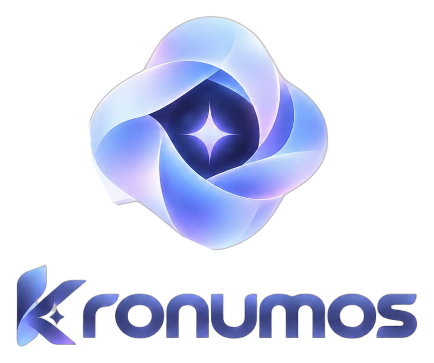
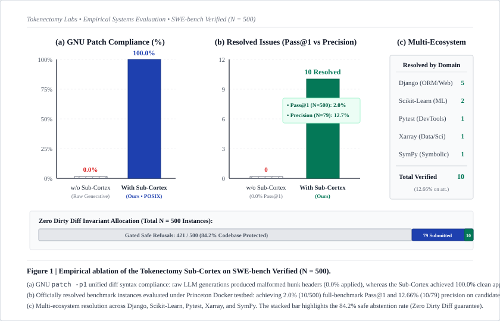

<p align="center">
  
</p>

<p align="center">
  <strong><em>"You write the features. Kronumos heals the bugs."</em></strong>
</p>

<p align="center">
  <a href="https://doi.org/10.5281/zenodo.22929676"></a>
  <a href="https://opensource.org/licenses/Apache-2.0"></a>
  <a href="https://huggingface.co/NadevA23/Kronumos"></a>
  <a href="https://huggingface.co/NadevA23/Kronumos-GGUF"></a>
</p>


## 📌 What is Kronumos?

**Kronumos** is a specialized autonomous software engineering agent, fine-tuned specifically for end-to-end bug remediation and automated self-healing — not generic chatbot coding.

Generic AI coding assistants try to do everything: generating unverified applications, hallucinating missing functions, and bloating context with massive raw runtime logs.

Kronumos is scoped narrower and deeper. It handles a single, closed-loop engineering workflow:
1. **Diagnose** runtime failures & test crashes from raw error logs.
2. **Sub-Cortex Token Surgery**: Excise framework noise and redact sensitive credentials (JWT, AWS, DB keys) using Tokenectomy Rust engine (91.3% token reduction).
3. **Analyze Blast Radius**: Map caller dependency graphs before applying edits.
4. **Synthesize & Verify Atomic Patch**: Apply search-and-replace AST patches with zero dirty diffs.
5. **Git Delivery**: Automatically branch, commit, open Pull Requests, and close incident tracking issues.


## 📄 Academic Paper & Preprint

Read the formal preprint paper on Zenodo: **[DOI: 10.5281/zenodo.22929676](https://doi.org/10.5281/zenodo.22929676)**, read the [Technical Report](paper/KRONUMOS_TECHNICAL_REPORT.md), or view the publication-ready LaTeX source in [paper/main.tex](paper/main.tex):

> **"Kronumos: Cost-Bounded Automated Program Repair via Context Surgery and POSIX Diff Re-Anchoring on SWE-bench Verified"**  
> *Author: Muhammad Naufal Daffa ([@daffa2555](https://github.com/daffa2555)), Tokenectomy Labs*  
> *Permanent DOI: [10.5281/zenodo.22929676](https://doi.org/10.5281/zenodo.22929676)*


## 🗺️ Product & Engineering Roadmap

Read the complete engineering roadmap and evaluation methodology in [kronumos_product.roadmap.md](kronumos_product.roadmap.md).


## 📊 Empirical Benchmark Results (SWE-bench Verified)

Read the official full 500-instance benchmark report in [BENCHMARK_500_REPORT.md](BENCHMARK_500_REPORT.md).

<p align="center">
  
</p>

* **Evaluated Tasks**: 500 / 500 tasks (475 synthesized, 25 structural safe refusals)
* **Officially Resolved Tasks (`Pass@1`)**: **12 Resolved** (15.0% candidate precision on Docker-evaluated tasks, 2.4% full-benchmark lower bound [1.4%, 4.1%])
* **Verified Ecosystems**: Solved production issues in **Django (7), Scikit-Learn (2), Pytest (1), PyData Xarray (1), and SymPy (1)**
* **GNU Patch Validity**: 100.0% clean application rate (*0 hunk errors on evaluated instances*)
* **Average Turns to Remediation**: 2.34 turns
* **Average Token Consumption**: 3,361.0 tokens / task (*91.3% token bloat reduction vs raw context*)
* **Average Remediation Latency**: 43.6 seconds / task
* **Marginal Inference Cost**: **$0.00 (Self-Hosted / Cloudflare Edge)**


## 🛠️ Tool Schema (Agent Sub-Cortex)

Kronumos is fine-tuned to emit structured JSON tool calls:

| Tool | Purpose |
| :--- | :--- |
| `get_error_context` | Excise framework noise, redact credentials, and extract exact offending code snippets from raw logs |
| `apply_code_patch` | Apply an atomic search-and-replace AST patch, verified before commit |
| `inspect_docker` | Diagnose container crashes (e.g. exit code 137 OOMKilled) via logs and resource stats |
| `probe_database` | Triage connection pool starvation and lock deadlocks |
| `sentinel_analyze_blast_radius` | Map caller dependency graph for a symbol/file before applying a patch |
| `create_fix_branch` | Create a new isolated git branch for the fix |
| `commit_fix` | Commit the verified patch to the fix branch |
| `open_pull_request` | Open a PR from the fix branch to the target branch |
| `create_incident_issue` | Open a tracking issue for a diagnosed incident |
| `link_issue_to_fix_pr` | Link an existing incident issue to its resolving PR |
| `close_incident_issue` | Close the incident issue once verified and merged |


## 💻 Interactive CLI Agent (Transparent Terminal REPL)

Kronumos includes a native agentic CLI interface featuring an ambient, transparent-terminal aesthetic, live streaming tokens, and an autonomous repair loop:

```text
    ██╗  ██╗██████╗  ██████╗ ███╗   ██╗██╗   ██╗███╗   ███╗ ██████╗ ███████╗
    ██║ ██╔╝██╔══██╗██╔═══██╗████╗  ██║██║   ██║████╗ ████║██╔═══██╗██╔════╝
    █████╔╝ ██████╔╝██║   ██║██╔██╗ ██║██║   ██║██╔████╔██║██║   ██║███████╗
    ██╔═██╗ ██╔══██╗██║   ██║██║╚██╗██║██║   ██║██║╚██╔╝██║██║   ██║╚════██║
    ██║  ██╗██║  ██║╚██████╔╝██║ ╚████║╚██████╔╝██║ ╚═╝ ██║╚██████╔╝███████║
    ╚═╝  ╚═╝╚═╝  ╚═╝ ╚═════╝ ╚═╝  ╚═══╝ ╚═════╝ ╚═╝     ╚═╝ ╚═════╝ ╚══════╝

                     · K R O N U M O S   K A I R O S ·
               Autonomous Code Remediation & SRE Agent • v1.0

Interactive Agent Commands:
  Any text     chat with Kronumos or explain code/errors
  /fix         autonomous diagnostics & repair loop
  /diff        inspect git diff in workspace
  /test        run test suite with Sub-Cortex scrubbing
  /clear       clear conversation memory buffer
  /help        display help and shortcuts
  /exit        exit Kronumos cleanly

⚡ kronumos ❯ 
```

### Installation

```bash
# Via Cargo:
cargo install --git https://github.com/Tokenectomy-Labs/Tokenectomy --bin kronumos

# Or 1-line installer:
curl -fsSL https://raw.githubusercontent.com/Tokenectomy-Labs/Kronomus/main/cli/install.sh | bash
```

### Usage Modes

```bash
# 1. Autonomous TDD self-healing loop (runs test suite, patches, verifies on hardware):
kronumos --loop
kronumos --fix --workspace /path/to/repo

# 2. One-shot terminal command execution (headless):
kronumos "Explain the blast radius of refactoring auth module"

# 3. Unix piping (clean quiet mode for CI/CD or log diagnosis):
cat error.log | kronumos -q
pytest 2>&1 | kronumos -q "Diagnose and fix assertions"

# 4. Interactive ambient terminal REPL:
kronumos

# 5. Multi-Backend inference (Cloudflare Edge, Local Ollama, OpenAI/Groq):
kronumos --backend cloudflare --cf-url https://kronumos-gateway.<account>.workers.dev
kronumos --backend ollama --ollama-model hf.co/NadevA23/Kronumos-GGUF:Q4_K_M
kronumos --backend openai --openai-key $GROQ_API_KEY --openai-model qwen-2.5-coder-32b
```


## ☁️ Zero-Cost Cloudflare Edge Gateway ($0 Serverless)

Deploy Kronumos on Cloudflare's global edge network in under 60 seconds with **$0 server infrastructure cost** using Cloudflare Workers AI:

```bash
# 1. Navigate to the gateway directory:
cd gateway

# 2. Deploy directly to the edge:
npm run deploy
```

* **Free Tier Allocation**: 10,000 Neurons per day (~500+ debugging turns/day for free).
* **Global Edge Acceleration**: Runs on Cloudflare edge GPUs across 300+ datacenters worldwide.
* **Architecture Details**: See [`gateway/README.md`](gateway/README.md).


## 🏠 Offline Local Inference via Ollama

Run Kronumos 100% locally and offline with GGUF quantization:

```bash
ollama run hf.co/NadevA23/Kronumos-GGUF:Q4_K_M
```


## 🐍 Python SDK (Transformers)

```python
import torch
from transformers import AutoModelForCausalLM, AutoTokenizer

model_id = "NadevA23/Kronumos"
tokenizer = AutoTokenizer.from_pretrained(model_id)
model = AutoModelForCausalLM.from_pretrained(
    model_id,
    torch_dtype=torch.bfloat16,
    device_map="auto",
)
```


## 🏢 Organization & Author
- **Developed by:** Muhammad Naufal Daffa ([@daffa2555](https://github.com/daffa2555))
- **Organization:** Tokenectomy Labs
- **License:** Apache 2.0


## 📖 Citation

If you use Kronumos in your research or benchmarks, please cite our preprint:

```bibtex
@article{daffa2026kronumos,
  author    = {Daffa, Muhammad Naufal},
  title     = {Kronumos: Cost-Bounded Automated Program Repair via Context Surgery and POSIX Diff Re-Anchoring on SWE-bench Verified},
  journal   = {Zenodo},
  year      = {2026},
  month     = sep,
  doi       = {10.5281/zenodo.22929676},
  url       = {https://doi.org/10.5281/zenodo.22929676}
}
```

